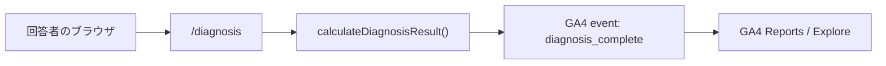

# 診断結果タイプ分布 GA4 最小集計構成案

作成日: 2026-04-26

## 1. 目的

診断完了者が 16 タイプのどれに偏ったかを、追加費用 0 円を優先して集計する。

最初に欲しい統計は次だけで十分とする。

- `typeCode` 別の診断完了件数
- `typeCode` 別の割合

本書では便宜上「人数」と表現する箇所があるが、実際には GA4 が受け取った `diagnosis_complete` の event count を指す。同じ人が複数回診断した場合は複数件として数える。ユーザー識別子を独自送信しないため、厳密なユニーク回答者数は追わない。

各設問の回答分布、回答個票、ユーザーごとの再計算、Firestore / GAS / Netlify Forms 連携は今回の実装対象に含めない。

## 2. 方針

最小構成は **GA4 のみ** とする。



診断完了時に `diagnosis_complete` event を 1 回だけ送信し、event parameter として `type_code` を付ける。

```text
event_name: diagnosis_complete
type_code: ALHN
```

GA4 側では `type_code` を event-scoped custom dimension として登録し、`diagnosis_complete` の event count を `type_code` で分解する。これで「どのタイプが何件出たか」と「各タイプの割合」が見られる。

## 3. 採用しないもの

### 3.1 Netlify Forms

採用しない。

このリポジトリの運用アカウントは Netlify Legacy plan 前提であり、無料フォーム枠が小さい。数千件規模の診断完了を流すと無料枠を使い切る可能性が高いため、代替案にも含めない。

### 3.2 Firebase / Firestore

今回の実装では採用しない。

Firestore は、将来「回答個票を保存したい」「診断ロジック変更後に過去回答を再計算したい」「GA4 欠損を避けたい」となった場合の拡張候補として残す。現時点では、回答者がどのタイプに偏ったかの件数が分かれば十分なので、GA4 だけで始める。

### 3.3 GAS / Google Sheets

今回の実装では採用しない。

手元で CSV 的な個票管理が必要になった場合の補助案に留める。最初から Apps Script Web App や Sheets append を入れない。

## 4. 収集データ

### 4.1 GA4 event

| 項目 | 値 | 必須 | 用途 |
| --- | --- | --- | --- |
| `event_name` | `diagnosis_complete` | yes | 診断完了数の母数 |
| `type_code` | `ALHN` など 16 タイプコード | yes | タイプ別件数と割合の集計軸 |

最小実装では `event_name` と `type_code` だけでよい。

### 4.2 送らないデータ

- ユーザー名
- 共有キー
- 32 問の回答値
- 軸スコア
- timestamp
- session ID / user ID 相当の独自 ID
- IP アドレス相当の値

理由:

- 今回の目的はタイプ別件数と割合だけである。
- 高カーディナリティな値は GA4 レポートで扱いにくく、公式にも避けるべきものとして案内されている。
- 個人情報や個票保存を避けることで、実装と運用を軽くする。

## 5. 必要な環境変数

### 5.1 追加する環境変数

| 変数 | 例 | 必須 | 説明 |
| --- | --- | --- | --- |
| `NEXT_PUBLIC_GA_MEASUREMENT_ID` | `G-REDACTED` | production では yes | GA4 Web data stream の Measurement ID |

`NEXT_PUBLIC_` 付きなので、値は build 後のブラウザ配信物に埋め込まれる。GA4 の Measurement ID はブラウザに公開される前提の ID なので、秘密情報として扱わない。

未設定時は GA4 script を読み込まず、`diagnosis_complete` も送信しない。これにより local / deploy preview では無効化できる。

### 5.2 Netlify 側の設定

本番環境の Netlify environment variables に次を設定する。

```text
NEXT_PUBLIC_GA_MEASUREMENT_ID=G-REDACTED
```

docs 上では実値を載せず、GA4 Measurement ID は `G-REDACTED` と表記する。実際の値は各環境の環境変数に設定する。

Deploy Preview で本番 GA4 にデータを混ぜたくない場合は、preview context では未設定にするか、preview 用 GA4 property / data stream の Measurement ID を設定する。

## 6. GA4 側で必要な作業

### 6.1 GA4 property / web data stream の作成

1. [Google Analytics](https://analytics.google.com/) を開く。
2. Account / Property を作成する。
3. Data stream で `Web` を選ぶ。
4. 本番 URL を入れて Web data stream を作成する。
5. Stream details から `G-` で始まる Measurement ID をコピーする。
6. その値を `NEXT_PUBLIC_GA_MEASUREMENT_ID` に設定する。

Google 公式手順では、Analytics property を作り、data stream を追加し、Measurement ID を取得して Google tag を設置する流れになっている。

### 6.2 custom dimension の登録

`type_code` を GA4 の event-scoped custom dimension として登録する。

| GA4 項目 | 設定値 |
| --- | --- |
| Dimension name | `Type code` |
| Scope | `Event` |
| Event parameter | `type_code` |
| Description | `診断完了時の16タイプコード` |

操作:

1. GA4 Admin を開く。
2. `Data display` > `Custom definitions` を開く。
3. `Custom dimensions` タブで `Create custom dimension` を押す。
4. 上表の値を入れて保存する。

補足:

- custom dimension は登録後、レポートや探索で使えるようになるまで 24 - 48 時間ほど待つ場合がある。
- GA4 標準 property では event-scoped custom dimensions は 50 個までなので、今回の `type_code` 1 個だけなら十分余裕がある。
- `type_code` の値は 16 種類だけなので、高カーディナリティ化しない。

### 6.3 Google tag 設置前提

後でコードへ反映する Google tag の前提は次とする。

```html
<!-- Google tag (gtag.js) -->
<script async src="https://www.googletagmanager.com/gtag/js?id=G-REDACTED"></script>
<script>
  window.dataLayer = window.dataLayer || [];
  function gtag(){dataLayer.push(arguments);}
  gtag('js', new Date());

  gtag('config', 'G-REDACTED');
</script>
```

Next.js 実装時はこの内容をそのまま文字列で直書きするのではなく、`app/layout.tsx` の `next/script` に載せ替え、`NEXT_PUBLIC_GA_MEASUREMENT_ID` から値を読む形にする。

### 6.4 集計の見方

最小確認:

1. GA4 の `Reports` > `Engagement` > `Events` を開く。
2. `diagnosis_complete` が発火していることを確認する。

タイプ別件数:

1. GA4 の `Explore` を開く。
2. Free form exploration を作る。
3. Dimensions に `Type code` を追加する。
4. Metrics に `Event count` を追加する。
5. Filter で `Event name exactly matches diagnosis_complete` を指定する。
6. Rows に `Type code`、Values に `Event count` を置く。

これで `ALHN: 123`, `DBTC: 98` のように、タイプ別の診断完了件数が見られる。

割合を見たい場合は、GA4 Explore 上で visualization を donut / bar にし、全体比を見る。今回の要件では Looker Studio など追加サービスは必須にしない。

## 7. コード反映箇所

今回は docs のみで、コードにはまだ反映していない。実装する場合は次の範囲に限定する。

追加 npm package は不要。Google tag は `next/script` と `window.gtag` で扱う。

### 7.1 `app/layout.tsx`

目的:

- `NEXT_PUBLIC_GA_MEASUREMENT_ID` が設定されている場合だけ Google tag を読み込む。
- 全ページの page view と custom event 送信の土台を作る。

実装方針:

- `next/script` を使う。
- Measurement ID 未設定時は script を出さない。
- `window.dataLayer` / `gtag` 初期化を root layout に置く。

反映イメージ:

```tsx
import Script from "next/script";

const gaMeasurementId = process.env.NEXT_PUBLIC_GA_MEASUREMENT_ID;

{gaMeasurementId ? (
  <>
    <Script
      src={`https://www.googletagmanager.com/gtag/js?id=${gaMeasurementId}`}
      strategy="afterInteractive"
    />
    <Script id="ga4-init" strategy="afterInteractive">
      {`
        window.dataLayer = window.dataLayer || [];
        function gtag(){dataLayer.push(arguments);}
        gtag('js', new Date());
        gtag('config', '${gaMeasurementId}');
      `}
    </Script>
  </>
) : null}
```

### 7.2 `lib/analytics.ts`

目的:

- GA4 送信処理を小さな client-safe helper に閉じ込める。
- Measurement ID 未設定時、ブラウザ外、`gtag` 未初期化時は何もしない。

想定 API:

```ts
type GtagWindow = Window & {
  gtag?: (
    command: "event",
    eventName: string,
    params?: Record<string, string | number | boolean>,
  ) => void;
};

function trackEvent(
  eventName: string,
  params?: Record<string, string | number | boolean>,
) {
  if (typeof window === "undefined") {
    return;
  }

  const gtag = (window as GtagWindow).gtag;

  if (!gtag) {
    return;
  }

  try {
    gtag("event", eventName, params);
  } catch {
    // Analytics must never block diagnosis result navigation.
  }
}

export function trackDiagnosisComplete(typeCode: string) {
  trackEvent("diagnosis_complete", {
    type_code: typeCode,
  });
}
```

### 7.3 `components/diagnosis/diagnosis-flow/diagnosis-flow.tsx`

目的:

- 診断完了時に `diagnosis_complete` を送る。

現在の診断完了処理:

```ts
const result = calculateDiagnosisResult(questionMaster, answers);
const key = createShareKey(userName, result.axisSummaries);
writePostDiagnosisResult(result.typeCode, key);
router.push(
  `${getTypePublicPath(result.typeCode)}?s=${encodeURIComponent(key)}`,
);
```

反映位置:

```ts
const result = calculateDiagnosisResult(questionMaster, answers);
trackDiagnosisComplete(result.typeCode);
const key = createShareKey(userName, result.axisSummaries);
```

送信失敗や `gtag` 未定義で結果ページ遷移を止めてはいけない。analytics helper 側で例外を握り、best effort にする。

### 7.4 型定義

TypeScript で `window.gtag` を参照する場合は、次のいずれかを行う。

- `lib/analytics.ts` 内で `window as Window & { gtag?: ... }` のように局所的に型付けする。
- 必要になったら `global.d.ts` を追加する。

最小実装では局所型で十分。

## 8. 検証手順

### 8.1 ローカル

1. `.env.local` に `NEXT_PUBLIC_GA_MEASUREMENT_ID=G-REDACTED` を入れる。
2. `npm run dev` を起動する。
3. ブラウザで診断を最後まで完了する。
4. GA4 Realtime report で `diagnosis_complete` を確認する。DebugView を使う場合は debug mode を有効にする。
5. event parameter に `type_code` が入っていることを確認する。

ローカルで本番 GA4 にデータを入れたくない場合は、ローカルでは env を未設定にする。

### 8.2 本番

1. Netlify production environment に `NEXT_PUBLIC_GA_MEASUREMENT_ID=G-REDACTED` を設定する。
2. production deploy を行う。
3. 本番 URL で診断を 1 回完了する。
4. GA4 Realtime report で `diagnosis_complete` を確認する。
5. 24 - 48 時間後、Explore で `Type code` x `Event count` を確認する。

## 9. 注意点

- GA4 は広告ブロッカー、ブラウザ設定、同意状態などで欠損する可能性がある。厳密な全回答数ではなく、GA4 が収集できた範囲の診断完了件数として見る。
- ユーザー名や共有キーは送らない。
- `type_code` は 16 種類だけなので custom dimension として扱いやすい。
- 厳密なユニーク回答者数ではなく、診断完了件数として扱う。
- 32 問の回答値は送らない。必要になったら別途 Firestore などを検討する。
- `diagnosis_complete` は結果計算後、ページ遷移前に送る。ただし送信完了を待たない。
- 診断結果ページを再訪しただけでは `diagnosis_complete` を送らない。送信箇所は診断フロー完了処理だけに限定する。

## 10. 将来拡張

今回の最小構成では未実装にするが、必要になったら次を追加候補にする。

| 拡張 | 目的 | 追加判断 |
| --- | --- | --- |
| 軸コード / 軸スコア | 4 軸の偏り確認 | タイプ分布だけでは足りなくなったら |
| Firestore | 回答個票の保存 | GA4 の集計値だけでは不足したら |
| BigQuery Export | GA4 生イベントの SQL 分析 | GA4 Explore だけでは足りなくなったら |

## 11. 参照した公式情報

- GA4 setup: <https://support.google.com/analytics/answer/9304153>
- GA4 custom dimensions / metrics: <https://support.google.com/analytics/answer/14240153>
- GA4 event-scoped custom dimension 作成: <https://support.google.com/analytics/answer/14239696>
- GA4 event collection limits: <https://support.google.com/analytics/answer/9267744>
- GA4 configuration limits: <https://support.google.com/analytics/answer/12229528>
- Next.js static export の未対応機能: `node_modules/next/dist/docs/01-app/02-guides/static-exports.md`
